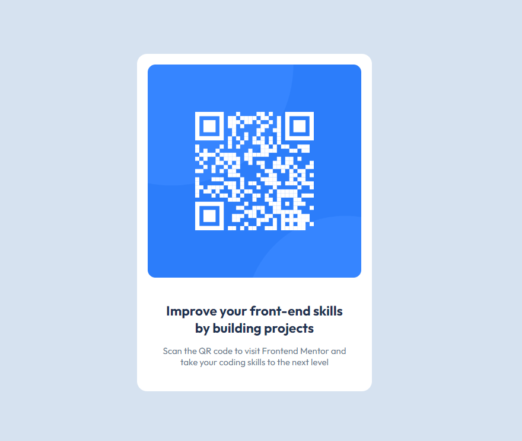

# Frontend Mentor - QR code component solution

This is a solution to the [QR code component challenge on Frontend Mentor](https://www.frontendmentor.io/challenges/qr-code-component-iux_sIO_H). Frontend Mentor challenges help you improve your coding skills by building realistic projects. 

## Table of contents

- [Overview](#overview)
  - [Screenshot](#screenshot)
- [My process](#my-process)
  - [Built with](#built-with)
  - [Useful resources](#useful-resources)

## Overview

This is my first front-end challenge from frontendmentor.com. I'm currently learning HTML and CSS and wanted to test what I've learned so far. I started my first challenge, which tasked me with creating a QR card for desktop and mobile devices. An image of the finished product is provided.

### Screenshot

- Solution URL: [Add solution URL here](https://your-solution-url.com)
- Live Site URL: [Add live site URL here](https://your-live-site-url.com)

## My process

First, I structured the elements using HTML to create a general layout of the card. Next, I created a CSS file and started to edit the styles. When editing the styles, I began by adjusting the QR image and card container. Afterwards, I centered the card container inside the main container. Next, I centered the content inside the card container and added padding. Then, I rounded the edges of the QR image and card container. Finally, I imported the given font and adjusted the font size and color.

### Built with

- Semantic HTML5 markup
- CSS custom properties
- Flexbox

### Useful resources

- [resource 1](https://www.w3schools.com/css/default.asp) 
- [resource 2](https://css-tricks.com/snippets/css/a-guide-to-flexbox/) 

